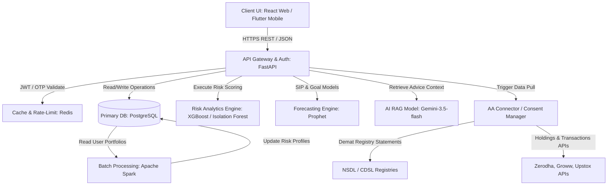
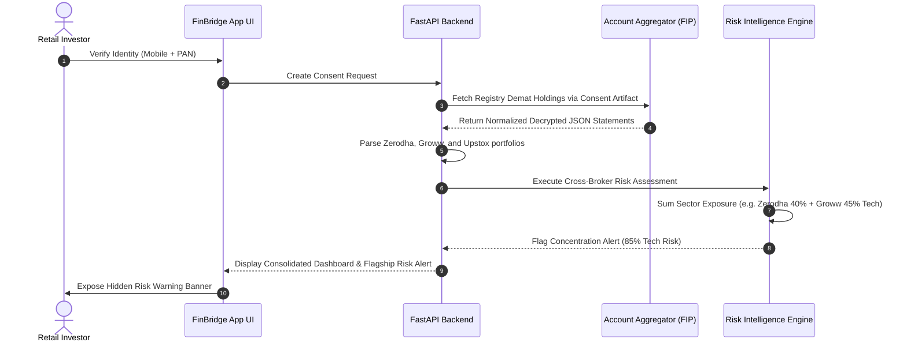
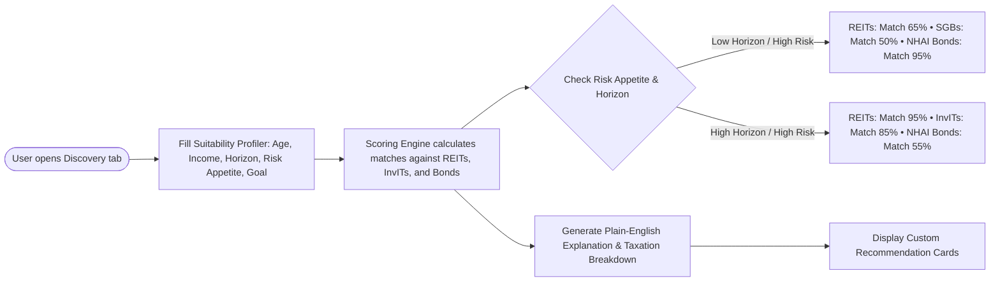

# FinBridge
### India's Unified Investment Intelligence Platform

<div align="left">
  
  
  
  
</div>

<div align="left">
  
  
  
</div>

> **One Identity. Every Investment. Institutional-Grade Clarity for Retail India.**
>
> *Focus Area: Super App for Unified Multi-Asset Investing and Financial Awareness for Retail Investors*

---

## 📖 Introduction

**FinBridge** is a secure, consent-first portfolio aggregation and investment intelligence platform designed specifically for retail investors in India. Built on top of India's regulated financial infrastructure, FinBridge consolidates an investor's holdings across multiple brokerages, depositories, and asset classes into a single, unified view. By replacing fragmented dashboards with institutional-grade risk analytics and suitability-first alternative asset discovery, FinBridge empowers retail participants to make informed, objective, and compliant investment decisions.

---

## 🚨 Problem Statement (PS)

India's retail investors face two compounding barriers that limit effective participation in securities markets:

1. **Fragmented Visibility**: Retail holdings are scattered across multiple brokers (Zerodha, Groww, Upstox, Angel One), depositories (NSDL, CDSL), and diverse asset classes. Investors lack a single consolidated view of their total holdings, exposure, and combined risk. While frameworks like the Account Aggregator (AA) and NSDL-CDSL Unified Investor Platform provide data-access plumbing, no integrated solution turns this data into unified, actionable portfolio intelligence.
2. **Shallow Alternate-Asset Access & Comprehension Lag**: Retail participation is heavily skewed towards equities and mutual funds. New instruments like REITs, InvITs, and corporate bonds are regularly introduced but remain under-discovered and under-explained, creating severe risks of mis-selling and unsuitable investment decisions due to the lag between product innovation and investor comprehension.

These gaps result in an opaque and inequitable investing experience where sophisticated portfolio diagnostics and multi-asset discovery remain accessible only to institutional and high-net-worth (HNW) investors.

---

## 💡 Solution

FinBridge resolves these gaps by combining portfolio aggregation, dynamic risk exposure analytics, and conversational intelligence with suitability assessments and plain-language product education.

### Core Capabilities:

* **Cross-Broker Risk Intelligence (Flagship Feature)**: Aggregates holdings across all linked demat accounts and exposes sector concentration risk that is invisible at the individual-broker level. For example, if a user has a 40% Technology sector allocation in Zerodha and a 45% Technology sector allocation in Groww, individual brokers see it as moderate. FinBridge consolidates the accounts and flags a **dangerously concentrated 85% technology position** to protect the investor from hidden sector selloffs.
* **Suitability-First Alternate Asset Discovery**: Profiles the investor first (age, income, horizon, risk tolerance, goals) and only then displays matched alternative assets (REITs, InvITs, bonds) with plain-language suitability match percentages, taxation rules, and lock-in explanations to prevent mis-selling.
* **Autonomous AI Agent Workspace**: A sandboxed area allowing users to deploy, monitor, and configure active financial loops. This includes a **Portfolio Rebalancer** that aligns assets to target risk metrics, a **Tax-Loss Harvesting Bot** that books capital losses to offset short-term capital gains tax while swapping assets to avoid wash-sales, and **Natural Language Guardrails** that translate plain-English rules into background monitors.
* **Plain-English Wealth Academy & Chat Advisor**: An interactive chatbot backed by Gemini-3.5-flash that answers user queries on alternative assets and compares products side-by-side (e.g., *ETFs vs. Mutual Funds*, *REITs vs. Physical Housing*).

### ⚔️ Industry Contrast Matrix

| Traditional Aggregators / Individual Brokers | FinBridge Unified Experience |
| :--- | :--- |
| ❌ **Siloed Exposure Views**: Zerodha, Groww, and Upstox operate as blind silos, unaware of external holding balances. | 🌐 **Consolidated Portfolio Intel**: Automatically maps, normalizes, and groups assets across all demat accounts. |
| ❌ **Hidden Concentration Risks**: Sector exposure is calculated per broker, masking dangerous combined asset allocations. | 🚨 **Cross-Broker Warnings**: Computes overall sector weights and triggers alerts for hidden sector overlaps. |
| ❌ **Product Catalog Spams**: Promotes alternative assets directly to retail users without suitability or knowledge checks. | 🧬 **Suitability-First Recommendations**: Profiles age, horizon, risk, and goals before displaying matching alternate assets. |
| ❌ **Comprehension Lag**: Uses complex prospectuses, leaving retail investors vulnerable to mis-selling. | 📖 **Plain-English Wealth Academy**: Simplifies mechanics, taxation, and liquidity rules in simple language. |
| ❌ **Manual Allocation & Harvest Math**: Forces investors to manually calculate rebalancing amounts and tax-loss offsets. | 🤖 **Autonomous AI Workspace**: Deploys rebalancing, tax-loss harvesting, and NLP guardrail agents. |

---

## 📐 System Architecture & Workflows

FinBridge separates presentation, orchestration, data aggregation, and compliance into distinct modular layers.

### 1. Overall System Architecture Block Diagram



### 2. Multi-Broker Data Aggregation & Risk Intelligence Workflow

This sequence diagram illustrates how FinBridge fetches fragmented data securely via Account Aggregators and calculates cross-broker sector concentrations that individual brokers cannot detect:



### 3. Suitability-First Recommendation Flow

This workflow illustrates how the suitability engine filters the alternative assets catalog to prevent mis-selling:



---

## 🛠 Technology Stack

The platform's technical architecture is outlined in the table below:

| Layer | Technology | Purpose & Implementation Details |
| :--- | :--- | :--- |
| **Frontend (Mobile)** | Flutter / React Native | Single cross-platform codebase compiling to native Android & iOS clients, ensuring fast interface iteration. |
| **Frontend (Web)** | React, TypeScript, Vanilla CSS | Implements a highly responsive, premium dashboard layout for desktop and tablet users. |
| **Backend & APIs** | FastAPI (Python) | High-throughput, asynchronous REST gateway handling data aggregation, risk calculations, and client queries. |
| **Primary Database** | PostgreSQL | Secure, relational storage for user profiles, linked holdings, transaction histories, and consent records. |
| **Caching & Sessions** | Redis | Low-latency session state, OTP authorization storage, rate limiting, and fast dashboard views. |
| **Risk Analytics Engine** | XGBoost & Isolation Forest | ML-driven concentration risk assessment and transaction-level behavioral anomaly detection. |
| **Forecasting Engine** | Prophet / ARIMA | Time-series forecasting for goal-based milestones and projected SIP growth progression. |
| **AI Reasoning Agent** | Gemini-3.5-flash | Orchestrated LLM with system instructions ensuring professional, objective financial insights. |
| **Batch Processing** | Apache Spark | Portfolio-wide tax auditing, rebalancing computations, and monthly Wealth Health Reports. |
| **Consent Management** | Account Aggregator (AA) Framework | Regulated, purpose-limited, time-bound, and revocable consent pipelines (FIP / FIU integration). |
| **Security Standards** | TLS 1.3 & AES-256 | High-grade encryption for data in transit and at rest, coupled with strict read-only demat queries. |

---

## 📁 Codebase Directory Structure

```
├── assets/                     # Media, banners, and static design resources
├── dist/                       # Production bundle outputs (HTML, CJS server, assets)
├── src/
│   ├── components/
│   │   ├── AdvancedReports.tsx            # Overlap analyzer, Dynamic Rebalancer, Tax Loss offsets
│   │   ├── AgenticAIWorkspace.tsx         # Rebalance Agent, Tax Harvest Bot, NLP Guardrails, log terminal
│   │   ├── AlternateAssetsDiscovery.tsx   # Investor suitability profiler, alternate asset catalog
│   │   ├── AIConversationalWidget.tsx     # Floating/Embedded RAG-based chat assistant
│   │   ├── LearnCenter.tsx                # Plain-English Wealth Academy (dictionary, comparison matrix)
│   │   ├── MetricCard.tsx                 # Dashboard metrics with micro-sparklines
│   │   ├── PortfolioChart.tsx             # Dynamic SVG/Canvas pie charts showing asset distributions
│   │   └── InvestmentsCenter.tsx          # Strategic Asset Heatmap & Sector matrix grid
│   ├── services/
│   │   └── brokerAggregation.ts           # Mock Account Aggregator API link and sync connectors
│   ├── App.tsx                            # Core router, onboarding flow container, and layout manager
│   ├── data.ts                            # Default sandbox portfolio holdings and wealth goals
│   ├── main.tsx                           # React DOM entrypoint
│   ├── types.ts                           # Shared interface types for Assets, Goals, AI insights
│   └── index.css                          # Tailwind CSS base styling
├── server.ts                   # Express server with mock API fallbacks & Gemini model bindings
├── package.json                # Project dependencies and build scripts
├── tsconfig.json               # TypeScript compiler config
└── vite.config.ts              # Vite asset bundler configuration
```

---

## 📈 Market Feasibility & Compliance

FinBridge treats regulatory guidelines as a core design constraint rather than a post-development afterthought:

* **SEBI Investment Adviser Regulations, 2013**: Providing specific transaction advice in India requires SEBI registration. FinBridge is architected as an **educational suitability screener** under Regulation 2(1)(m), which evaluates asset fit and explains structural features without prescribing specific buying transactions. For actual execution, it supports seamless API integration with SEBI-registered Investment Advisers (RIAs).
* **Account Aggregator Native Consent**: Consent management is built native to the RBI-regulated Account Aggregator architecture. Consent artifacts are purpose-limited, time-bound, and fully revocable by the investor at any time. Data remains blind in transit, ensuring user privacy.
* **Read-Only API Boundaries**: FinBridge restricts its aggregation layer to read-only statements and holdings APIs, aligning with existing Indian securities registries (NSDL/CDSL) and broker consent flows.

---

## 🚀 Running the Sandbox Application Locally

To run the application sandbox and explore the unified portfolio dashboard, suitability engine, and autonomous agents:

### Prerequisites
* **Node.js** (v18 or higher recommended)
* NPM (packaged with Node.js)

### Step-by-Step Installation

1. **Clone the Repository**
   ```bash
   git clone https://github.com/HardikMathur11/FinBridge.git
   cd FinBridge
   ```

2. **Install Dependencies**
   ```bash
   npm install
   ```

3. **Configure Environment Variables**
   * Create a `.env` file in the root directory:
     ```env
     GEMINI_API_KEY=your_gemini_api_key_here
     ```
   * *Note: If no API key is supplied, FinBridge automatically falls back to an offline rule-based analytics engine.*

4. **Build and Run the Server**
   * Compile the production bundle and launch the local server:
     ```bash
     npm run build
     ```
   * Start the server in development mode (with hot-reloading for UI changes):
     ```bash
     npm run dev
     ```

5. **Access the App**
   * Open your web browser and navigate to: **`http://localhost:3000`**

---

## ⚖️ Disclaimer & Compliance

FinBridge is an educational and analytical platform designed to enhance financial literacy and showcase dynamic multi-broker risk consolidation. 
* **No Direct Solicitation**: This platform displays investment options (REITs, InvITs, and bonds) with objective, plain-language suitability details and Indian taxation breakdowns for educational purposes. It does not provide direct buy/sell advisories or execute transactions.
* **SEBI Compliance**: Under SEBI (Investment Advisers) Regulations, 2013, FinBridge operates as an educational suitability screener rather than an active advisory service. For real market execution, the system is designed to integrate with SEBI-Registered Investment Advisers (RIAs).
* **Data Security**: All statements are fetched securely, utilizing sandboxed Account Aggregator models. Consent is revocable, purpose-limited, and data-blind in transit.

---

<p align="center">
  Built by <b>Team investIQ</b>
</p>
