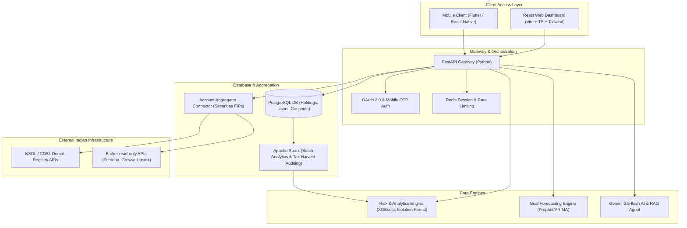

# FinBridge (InvestOne AI)
### India's Unified Investment Intelligence Platform

> **One Identity. Every Investment. Institutional-Grade Clarity for Retail India.**
>
> *Developed for Hackathon Problem Statement 3: Super App for Unified Multi Asset Investing and Awareness for Retail Investors.*

---

## 📌 Executive Summary

Retail investors in India are participating in the capital markets in record numbers. However, they face two compounding gaps that the current securities market ecosystem has not yet resolved:
1. **Fragmented Visibility**: Holdings are scattered across multiple brokers (Zerodha, Groww, Upstox, Angel One), depositories (NSDL, CDSL), and asset classes, with no single dashboard showing total exposure and combined risk.
2. **Shallow Alternate-Asset Access & Mis-selling**: While alternative investment instruments (REITs, InvITs, corporate bonds, and gold bonds) offer yield diversification, they remain under-discovered and under-explained, leading to comprehension lags and unsuitable investment choices.

**FinBridge (InvestOne AI)** is a secure, consent-first portfolio aggregation and intelligence super app built on top of India's existing regulated infrastructure (Account Aggregator framework and depository registries). It consolidates an investor's stocks, mutual funds, REITs, InvITs, corporate bonds, and gold bonds into an institutional-grade dashboard. It highlights hidden risk concentrations across separate brokers and provides suitability-first, plain-language alternate asset discovery.

---

## 🛠 Core Differentiators (Implemented & Demoable)

### 1. Cross-Broker Risk Intelligence (Flagship Capability)
Individual brokers operate in silos. They cannot see an investor's full exposure across other platforms. FinBridge aggregates holdings across every linked account and exposes concentration risk that is invisible at the individual-broker level:
* **The Blind Spot**: A user holds a 40% Technology sector allocation in Zerodha and a 45% Technology sector allocation in Groww. Each broker flags their respective portfolio as "moderately exposure-diversified" (under 50% sector weight).
* **The FinBridge Reveal**: FinBridge consolidates the accounts and triggers a **"Hidden Sector Concentration Alert"** showing that **85% of the user's total wealth is concentrated in Technology**. This visual alert maps out the exposure by broker, alerting the investor to systemic risk that no single broker could detect.

### 2. Suitability-First Alternate Asset Discovery
Rather than promoting financial products or presenting a generic catalog, FinBridge implements a **SEBI-compliant Suitability Profiler**:
* **Investor Profiler**: Gathers age, income, investment horizon, risk appetite, and primary investment goals.
* **Dynamic Matchmaking**: Evaluates the profile against curated Indian alternate assets (REITs, InvITs, corporate bonds, gold bonds).
* **Plain-Language Explanations**: Surfaces suitability match scores alongside clear details on **underlying assets** (e.g., commercial business parks for REITs, power transmission lines for InvITs), **liquidity/lock-ins**, and **Indian taxation rules** (slabs vs. capital gains tax) to prevent mis-selling.

### 3. Autonomous AI Agent Workspace
A dedicated tab where users can deploy, monitor, and configure sandboxed financial agents:
* **Portfolio Rebalance Agent**: Automatically detects asset deviations from the user's selected risk plan (Conservative, Moderate, Aggressive) and simulates block buy/sell orders across linked demat accounts.
* **Tax-Loss Harvesting Bot**: Scans brokerages for loss-making holdings and simulates a tax-loss harvest. It books capital losses to offset short-term capital gains tax while swapping assets into low-cost substitute index trackers to avoid wash-sale rule violations.
* **Natural Language Guardrails**: Allows investors to write custom portfolio rules in plain English (e.g., *"If Technology exposure exceeds 35%, route 5% to Cash equivalents"*), which the system parses and deploys as active background audit monitors.

### 4. Plain-English Wealth Academy & Conversational Advisor
An embedded chat widget powered by LLMs (offline-fallback resilient) acts as a certified wealth advisor:
* Answers queries on complex vehicles like REITs, InvITs, and Gold Bonds.
* Compares asset classes side-by-side (e.g., *ETFs vs. Mutual Funds*, *REITs vs. Physical Real Estate*) using simple, objective financial terms.

---

## 📐 System Architecture & Technical Stack

FinBridge treats regulatory reality as a design constraint, not an afterthought. It separates presentation, orchestration, data aggregation, and compliance into distinct modular layers.



### Stack Breakdown:
* **Frontend Mobile**: **Flutter** or **React Native**. Consolidates Android and iOS clients into a single codebase.
* **Frontend Web**: **React** with **TypeScript** and **Tailwind CSS** (Vite-bundler powered) for a highly responsive, modern dashboard.
* **Backend & APIs**: **FastAPI (Python)** using asynchronous endpoints. Ensures high throughput, low latency, and smooth integration with analytics models.
* **Primary Database**: **PostgreSQL** for structured storage of linked holdings, user profiles, transaction logs, and active consents.
* **Caching & Sessions**: **Redis** for rate limiting, OTP storage, session state management, and fast dashboard views.
* **Risk & Analytics Engine**: **XGBoost** for concentration risk assessment, **Isolation Forest** for anomaly and behavioral panic-selling detection, and custom rule-based exposure validators.
* **Goal Forecasting**: **Prophet** or **ARIMA** models for time-series forecasting of milestone projection goals (SIP progression rates, CAGR modeling).
* **RAG & Conversational Layer**: **Gemini-3.5-flash** integrated with structured system prompts. It serves as an objective wealth analyst, utilizing Retrieval-Augmented Generation (RAG) mapped to official SEBI investor education resources to eliminate hallucinations.
* **Batch Processing**: **Apache Spark** for running complex analytics jobs, including tax-loss harvesting calculations and generating monthly portfolio reports.
* **Consent Infrastructure**: Native SEBI/RBI **Account Aggregator** consent artifacts. Consent is revocable, purpose-limited, time-bound, and strictly data-blind in transit.
* **Security & Encryption**: **TLS 1.3** for all APIs, **AES-256** for encryption at rest, role-based access controls, and detailed audit trails.

---

## 📁 Codebase Directory Structure

The repository represents a clean, production-ready React web interface powered by an Express mock backend (serving development middleware and hosting the local Gemini proxy):

```
├── assets/                     # Media, banners, and static design resources
├── dist/                       # Production bundle outputs (HTML, CJS server, assets)
├── src/
│   ├── components/
│   │   ├── AdvancedReports.tsx            # Overlap analyzer, Dynamic Rebalancer, Tax Loss offsets
│   │   ├── AgenticAIWorkspace.tsx         # Rebalance Agent, Tax Harvest Bot, NLP Guardrails, log terminal
│   │   ├── AlternateAssetsDiscovery.tsx   # Investor suitability profiler, alternate asset catalog
│   │   ├── AIConversationalWidget.tsx     # Floating/Embedded RAG-based chat assistant
│   │   ├── LearnCenter.tsx                # Plain-English Wealth Academy (dictionary, comparison matrix)
│   │   ├── MetricCard.tsx                 # Dashboard metrics with micro-sparklines
│   │   ├── PortfolioChart.tsx             # Dynamic SVG/Canvas pie charts showing asset distributions
│   │   └── InvestmentsCenter.tsx          # Strategic Asset Heatmap & Sector matrix grid
│   ├── services/
│   │   └── brokerAggregation.ts           # Mock Account Aggregator API link and sync connectors
│   ├── App.tsx                            # Core router, onboarding flow container, and layout manager
│   ├── data.ts                            # Default sandbox portfolio holdings and wealth goals
│   ├── main.tsx                           # React DOM entrypoint
│   ├── types.ts                           # Shared interface types for Assets, Goals, AI insights
│   └── index.css                          # Tailwind CSS base styling
├── server.ts                   # Express server with mock API fallbacks & Gemini model bindings
├── package.json                # Project dependencies and build scripts
├── tsconfig.json               # TypeScript compiler config
└── vite.config.ts              # Vite asset bundler configuration
```

---

## 🚀 Running the Sandbox Prototype Locally

To run the application sandbox and explore the unified portfolio dashboard, suitability engine, and autonomous agents:

### Prerequisites
* **Node.js** (v18 or higher recommended)
* NPM (comes packaged with Node.js)

### Step-by-Step Installation

1. **Clone the Repository**
   ```bash
   git clone https://github.com/HardikMathur11/FinBridge.git
   cd FinBridge
   ```

2. **Install Dependencies**
   ```bash
   npm install
   ```

3. **Configure Environment Variables**
   * Duplicate `.env.example` to `.env.local` or `.env` in the root directory:
     ```bash
     cp .env.example .env
     ```
   * Set your `GEMINI_API_KEY` in the newly created file:
     ```env
     GEMINI_API_KEY=your_actual_gemini_api_key_here
     ```
   * *Note: If no API key is supplied, FinBridge automatically falls back to an offline analytics engine, providing high-fidelity simulations.*

4. **Build and Run the Server**
   * To compile the production bundle and launch the local server:
     ```bash
     npm run build
     ```
   * To start the server in development mode (with hot-reloading for UI changes):
     ```bash
     npm run dev
     ```

5. **Access the App**
   * Open your web browser and navigate to: **`http://localhost:3000`**

---

## 🛡 Regulatory Feasibility & Compliance

FinBridge treats compliance as a core design constraint rather than a post-development afterthought:
* **The "Advice" vs. "Education" Boundary**: Under **SEBI (Investment Advisers) Regulations, 2013**, providing prescriptive, client-specific buy/sell advice requires formal registration. FinBridge operates strictly as an **educational suitability screener** that identifies risk alignment based on mathematical profiles rather than advising direct transactions. For full deployment, the platform is structured to integrate with SEBI-registered Investment Advisers (RIAs) via APIs.
* **Account Aggregator Native Consent**: All data pulls operate strictly within the **SEBI/RBI Account Aggregator (AA) framework**. Consent is requested at the registry level, is fully revocable by the user, time-bound, and read-only.
* **No Trading-API Assumptions**: The V1 solution focuses on holdings-level read aggregation. It does not assume full order-placement API access, which is not yet universally available across the Indian brokerage ecosystem. This aligns perfectly with current regulatory constraints.
